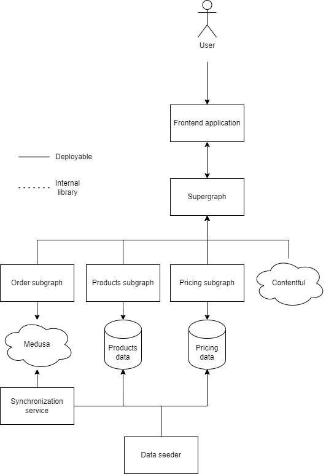

# Microshop
A MACH-based e-commerce demo application

## This README is still WIP

# CLI
All commands are to be executed in the root (`~`) folder, making use of pnpm workspaces
* pnpm install
* pnpm run dev
* pnpm run build
* pnpm run start

# Used libraries and frameworks
* [NextJS (13 beta)](https://beta.nextjs.org/docs)
* [Apollo Federation](https://www.apollographql.com/docs/federation)
* [Medusa](https://medusajs.com/)
* [Contentful](https://www.contentful.com/)

# Architecture
